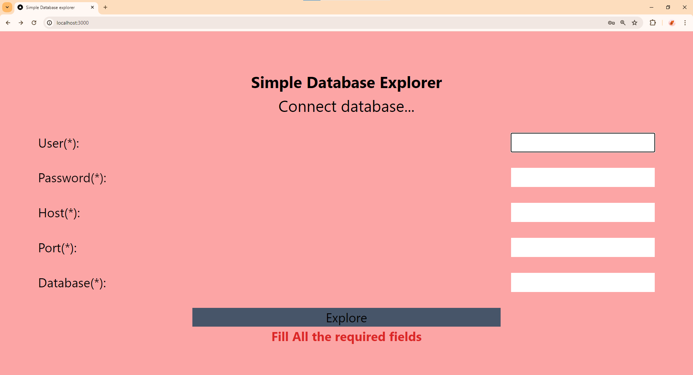
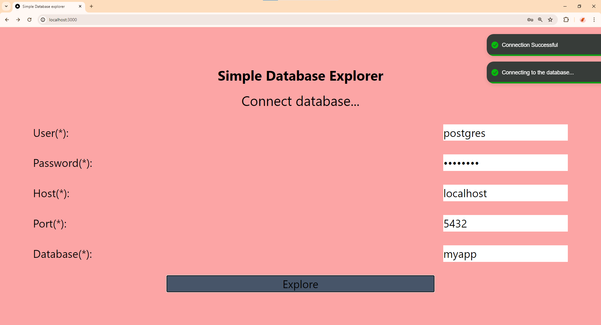
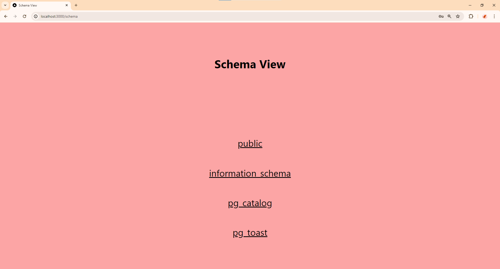
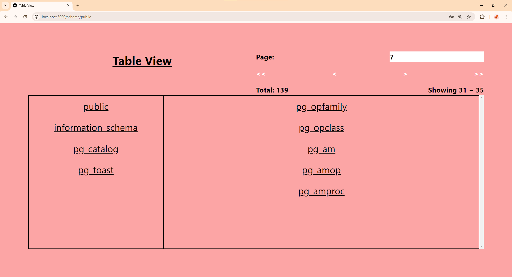
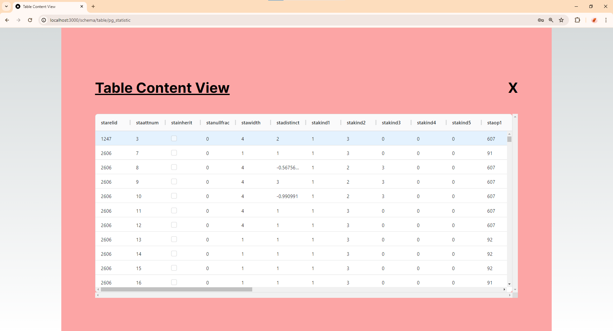
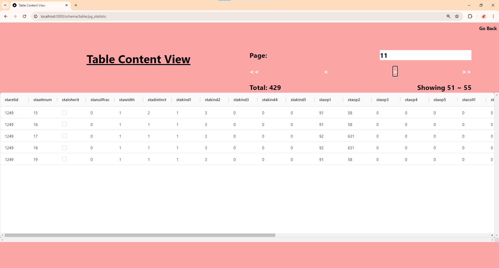

# Simple Database explorer - frontend

## Getting Started

First, run the development server:

```bash
npm run dev
# or
yarn dev
# or
pnpm dev
# or
bun dev
```

Open [http://localhost:3000](http://localhost:3000) with your browser to see the result.

## Features
- Next.js 14 with App Router for page routing
- React Hook Form for form handling and validation
- Server Actions for making API requests instead of direct fetch calls
- Pagination implemented for data tables
- Notification implementation with react-toastify
- Table view implementation with AgGrid
- Jest for unit testing and write down 3 testing cases
- Playwright for E2E testing and write down 3 testing cases

## Tech stacks
- Next.js 14: Server actions
- TypeScript
- tailwind css
- React Hook Form
- React-toastify
- AgGrid
- Jest
- Playwright

## Challenges
- Next.js 14 new features including server actions and intercept routing
- Displaying data with ag-grid-react library
- Configuration issue with Jest and Playwright

## Screens
- Login Page & Validation


- Login Page & Authentication & Notification



- Schema View Screen


- Table View Screen


- Table Content View Screen


